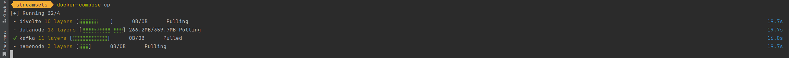
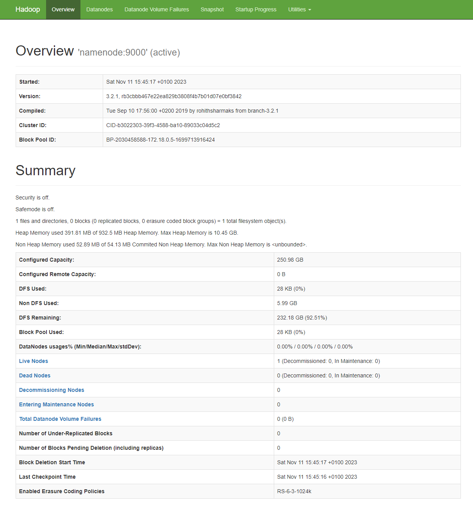

## Local installation for tests with Divolte and StreamSets Tools

----

### Installation process: 

---

1. Install **Docker Desktop** and [Docker Compose](https://docs.docker.com/engine/reference/commandline/compose/)
2. **Clone the content of the repository** to your local machine
3. **Set up the containers** using Docker Compose via `docker-compose up`
4. **Check your containers** via `docker ps -a` and if you will see failed containers user `docker logs <container_name>`
5. Check Logs for the errors

Set-up process:

To enter the hdfs command line interface (CLI) use:

`docker exec -it streamsets-namenode-1 /bin/bash`

Also, the Web UI is available under `localhost:9870`

---

### Credentials:

---

**Default Credentials** for the settings are:

* Login: `admin`
* Password: `admin`

---

### Possible Issues and Troubleshooting:

---

* `Streamsets: java.io.FileNotFoundException: /data/sdc.id (Permission denied)`
You should set permissions via `chmod 777 sdc-data`

 
* `StreamSets: Connection to node -1 could not be established. Broker may not be available` Check errors in Kafka container

* `Kafka: exited: kafka (exit status 1; not expected)` Check the docker settings and its memory limits (good to be set at least 6 GB or more) 

* `Streamsets: Configuration of maximum open file limit is too low: 1024 (expected at least 32768)` Add ulimits configuration in docker-compose.yml

